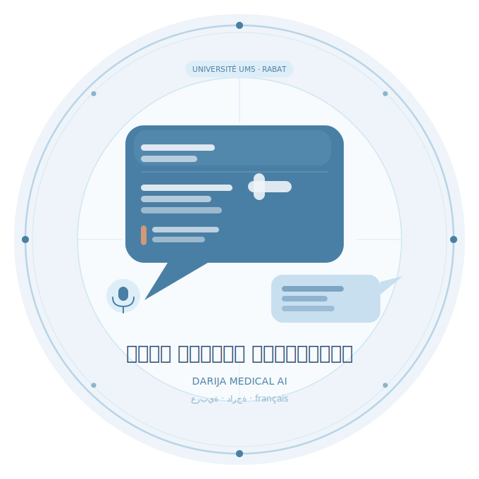
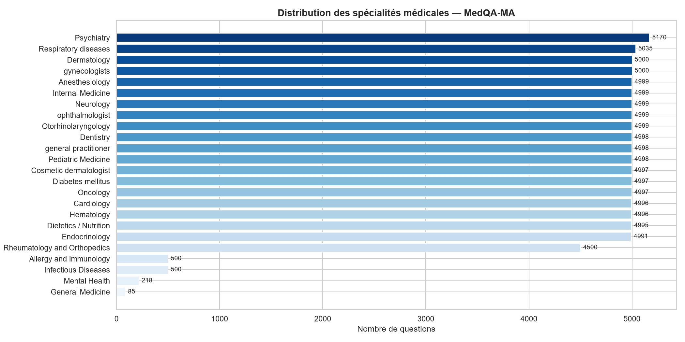
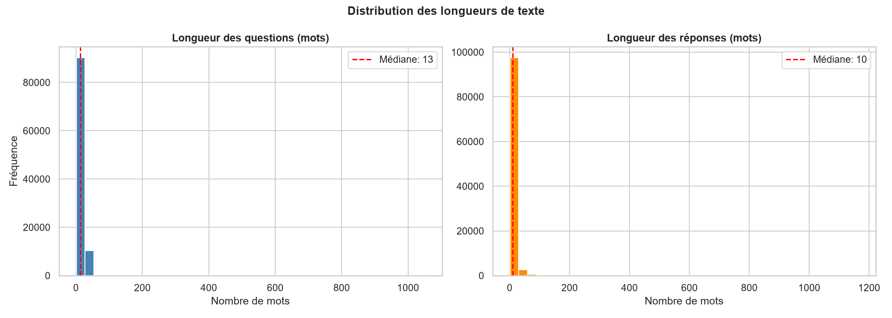
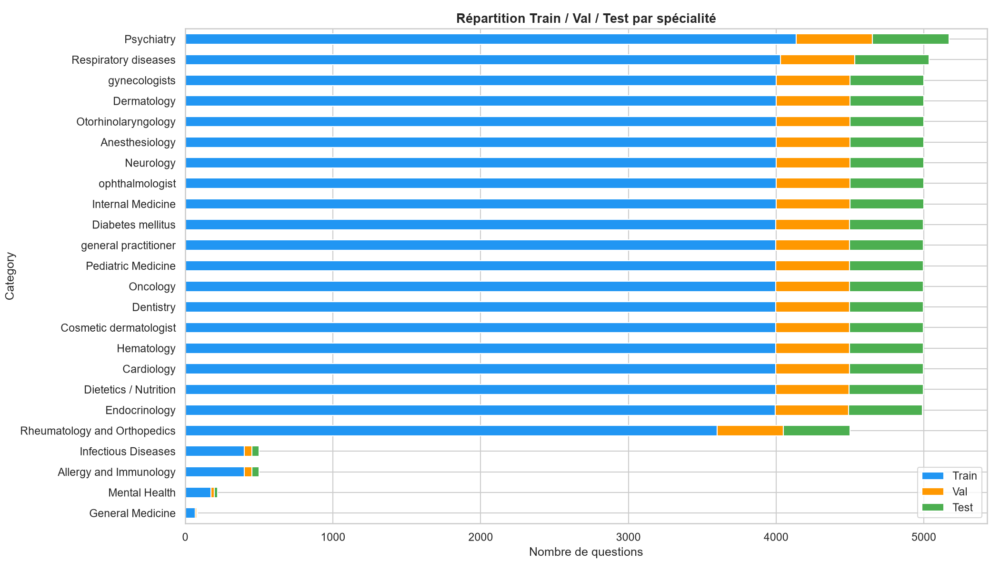

<p align="center">
  
</p>

<h1 align="center">🏥 Chatbot Médical — Darija / العربية / Français</h1>

<p align="center">
  Projet de Master IT — Université Mohammed V, Faculté des Sciences, Rabat<br/>
  Encadrant : Pr. Abdelhak Mahmoudi | Co-encadrants : Pr. Saad Frihi &amp; Pr. Yasine Lehmiani<br/>
  Année académique : 2025-2026
</p>

---

## Equipe

| Nom | Email |
|---|---|
| Chaymae BENRHANEM | chaymaebenrhanem02@gmail.com |
| Fatima BADAOUI | fatimabadaoui1@gmail.com |

---

## Description

Assistant conversationnel médical multilingue combinant une interface Streamlit et une API FastAPI. Le système collecte les symptômes via un dialogue guidé en 5 étapes, identifie la spécialité médicale adaptée par un modèle BERT, et retourne jusqu'à 3 médicaments disponibles au Maroc avec posologie, effets secondaires et avertissements de sécurité — le tout dans la langue choisie par l'utilisateur.

### Objectifs

- Concevoir un système d'assistance conversationnelle adapté aux demandes médicales
- Traiter les entrées utilisateur en texte **et** en format vocal
- Supporter le multilinguisme avec attention particulière à la **Darija marocaine**, l'Arabe classique et le Français
- Extraire des informations structurées depuis des requêtes en langage naturel
- Appliquer des règles de sécurité médicale (âge, allergie, grossesse, personnes âgées)

---

## Fonctionnalités

| Fonctionnalité | Détail |
|---|---|
| **3 langues** | Darija, Arabe, Français — sélecteur via popover cliquable |
| **Saisie vocale** | faster-whisper `small` + `int16`, forcé `ar` ou `fr` selon la langue |
| **Spécialité médicale** | `Chaymaae/darija-medical-bert` (24 classes, seuil confiance 0.5) |
| **Médicaments suggérés** | Jusqu'à 3 par symptôme, posologie adulte/enfant selon l'âge |
| **Effets secondaires** | Affichés pour chaque médicament suggéré |
| **Alertes sécurité** | Âge minimum, grossesse, allaitement, allergie, AINS > 65 ans |
| **Contenu bilingue** | Champs `*_ar` / `*_fr` dans le JSON — aucune traduction à la volée |

---

## Architecture

```
arabic-darija-chatbot/
├── api/
│   ├── main.py                    # FastAPI — endpoint POST /predict
│   └── streamlit_app.py           # Interface Streamlit (port 8501)
├── nlp/
│   ├── ner/
│   │   └── medication_extractor.py    # Détection symptômes + sélection médicaments
│   └── intent_detection/
│       └── intent_classifier.py       # Classification d'intention (metadata)
├── data/
│   └── morocco_medications.json       # Base de 26 médicaments (AR + FR)
├── notebooks/
│   └── exploration/
│       ├── explore.py                 # Exploration basique du CSV
│       └── data_visualization.ipynb  # Visualisations : spécialités, longueurs, split
├── nlp/preprocessing/
│   ├── preprocess.py                  # Nettoyage + split train/val/test
│   └── results/                       # Graphiques générés (.png)
└── .streamlit/
    └── config.toml                    # fileWatcherType = "none" (évite les warnings transformers)
```

### Pipeline d'entraînement du modèle BERT

Le modèle de classification de spécialités médicales a été entraîné en dehors de ce dépôt, selon ce pipeline :

```
Dataset MedQA-MA (CSV)
  Questions/Réponses en Darija — 24 spécialités médicales
        │
        ▼
  Google Colab
  ├── Chargement de CAMeL-Lab/bert-base-arabic-camelbert-mix
  ├── Fine-tuning sur MedQA-MA (classification 24 classes)
  ├── Évaluation sur jeu de test
  └── Export du modèle fine-tuné
        │
        ▼
  HuggingFace Hub
  └── Chaymaae/darija-medical-bert   (modèle publié)
        │
        ▼
  api/main.py  (chargement automatique au démarrage)
  └── AutoModelForSequenceClassification.from_pretrained("Chaymaae/darija-medical-bert")
```

### Flux d'une requête

```
Utilisateur (texte / audio)
        │
        ▼
  Streamlit (5 étapes)
  symptôme → durée → âge → allergie → autres symptômes
        │
        ▼  POST /predict  (question, age, allergy, other_symptoms, duration, ui_language)
        │
        ▼
  FastAPI main.py
  ├── detect_language()
  ├── predict_specialty()  ← Chaymaae/darija-medical-bert (HuggingFace)
  ├── detect_intent()
  └── get_medication_info()  ← medication_extractor
            ├── extract_symptom()    (tri par longueur, patterns FR + AR + Darija)
            ├── filtrer par âge
            ├── build_safety_warnings()
            └── lire dosage_fr ou dosage_ar selon ui_language
        │
        ▼
  Résultat localisé → Streamlit render_result()
```

---

## Installation

**Terminal 1 — Cloner le projet et créer l'environnement :**

```bash
git clone https://github.com/ChaymaeBenrhanem02/arabic-darija-chatbot.git
cd arabic-darija-chatbot

# Créer et activer l'environnement virtuel
python -m venv venv
venv\Scripts\activate          # Windows
# source venv/bin/activate     # Linux/macOS

# Installer les dépendances
pip install -r requirements.txt
```

> **ffmpeg non requis** : l'audio est écrit dans un fichier WAV temporaire passé directement à faster-whisper.

---

## Lancement

Ouvrir **3 terminaux** depuis la racine du projet :

```bash
# Terminal 2 — Backend API (port 8000)
cd arabic-darija-chatbot
venv\Scripts\activate
uvicorn api.main:app --reload
```

```bash
# Terminal 3 — Interface web (port 8501)
cd arabic-darija-chatbot
venv\Scripts\activate
streamlit run api/streamlit_app.py
```

Ouvrir **`http://localhost:8501`** dans le navigateur.

---

## Endpoint API

### `POST /predict`

```json
{
  "question":       "عندي صداع",
  "age":            "35",
  "allergy":        "لا",
  "other_symptoms": "حمى",
  "duration":       "يومان",
  "ui_language":    "ar"
}
```

**Réponse :**
```json
{
  "specialty":        "General Medicine",
  "confidence":       0.71,
  "symptom_detected": "صداع",
  "medications": [
    {
      "name":       "paracetamol",
      "dosage":     "بالغون: قرص واحد (500mg) كل 6 ساعات",
      "side_effects": "نادراً: حساسية جلدية...",
      "warnings":   "لا تتجاوز الجرعة الموصى بها...",
      "do_not_use": "أمراض الكبد الشديدة",
      "ask_doctor": "إذا كنت تتناول أدوية أخرى...",
      "safety_warnings": []
    }
  ]
}
```

---

## Base de médicaments

Fichier : `data/morocco_medications.json` — 26 médicaments.

Chaque entrée contient des champs parallèles arabe (`*_ar`) et français (`*_fr`) :

| Champs | Description |
|---|---|
| `dosage_ar` / `dosage_fr` | Posologie adulte |
| `dosage_enfant_ar` / `dosage_enfant_fr` | Posologie enfant (utilisée si âge < 18) |
| `side_effects_ar` / `side_effects_fr` | Effets secondaires |
| `warnings_ar` / `warnings_fr` | Avertissements |
| `do_not_use_ar` / `do_not_use_fr` | Contre-indications absolues |
| `ask_doctor_ar` / `ask_doctor_fr` | Quand consulter |
| `age_min` | Âge minimum (0 = tous âges) |
| `interdit_grossesse` | Booléen — contre-indiqué pendant la grossesse |
| `interdit_allaitement` | Booléen — contre-indiqué pendant l'allaitement |
| `allergie_keywords` | Mots-clés pour conflit d'allergie |

**Médicaments inclus :** paracétamol, ibuprofène, aspirine, amoxicilline, azithromycine, ciprofloxacine, cétirizine, loratadine, metformine, glibenclamide, amlodipine, ramipril, aténolol, salbutamol, montélukast, oméprazole, métoclopramide, lopéramide, diazépam, sertraline, atorvastatine, diclofénac, prednisolone, fluoxétine, vitamine D3, fer.

---

## Visualisation du Dataset MedQA-MA

> Notebook : `notebooks/exploration/data_visualization.ipynb`

### Distribution des spécialités médicales



### Longueur des questions et réponses



### Répartition Train / Val / Test



**Observations clés :**
- **100 966 questions** au total — 24 spécialités médicales
- Dataset **déséquilibré** : Psychiatry (5 170 ex.) vs General Medicine (85 ex.)
- Textes courts : médiane **13 mots/question**, **10 mots/réponse** (Darija)
- Split stratifié : **80 % train** / **10 % val** / **10 % test**

---

## Détection des symptômes

Correspondance de mots-clés dans `SYMPTOMS` (Darija + Arabe + Français). Les patterns longs sont vérifiés en premier (`extract_symptom` trie par longueur décroissante) pour éviter les faux positifs.

| Entrée utilisateur | Détecté comme | Médicament principal |
|---|---|---|
| `j'ai mal à la tête` | headache | paracétamol |
| `مaux de tête` | headache | paracétamol |
| `في أسخانة` / `سخانة` | fever | paracétamol |
| `كنحس بصداع` | headache | paracétamol |
| `douleur` | pain | ibuprofène |
| `j'ai la toux` | cough | salbutamol |

---

## Alertes de sécurité automatiques

| Situation | Message |
|---|---|
| Âge < `age_min` du médicament | Bloqué avec message d'erreur |
| Âge ≥ 65 ans + AINS (ibuprofène, diclofénac, aspirine) | Avertissement risque rénal/cardiovasculaire |
| `interdit_grossesse = true` + mot-clé grossesse détecté | Contre-indication affichée |
| `interdit_allaitement = true` + mot-clé allaitement détecté | Contre-indication affichée |
| Allergie déclarée correspondant à `allergie_keywords` | Avertissement allergie |

---

## Tests

Le dossier `tests/` contient **74 tests unitaires** organisés en 3 fichiers :

| Fichier | Ce qui est testé | Tests |
|---|---|---|
| `test_symptom_detection.py` | `extract_symptom()`, `parse_age()`, `normalize_text()` — détection FR/AR/Darija | 34 |
| `test_safety_rules.py` | `build_safety_warnings()`, `check_allergy_conflict()` — âge, grossesse, allaitement, allergie | 27 |
| `test_api.py` | Endpoint `POST /predict` avec modèle BERT mocké | 13 |

```bash
# Installer pytest (une seule fois)
pip install pytest

# Lancer tous les tests
pytest tests/ -v
```

> Le modèle BERT est automatiquement mocké dans `test_api.py` — les tests s'exécutent en quelques secondes sans téléchargement.

---

## Dépendances

| Package | Version | Rôle |
|---|---|---|
| `streamlit` | 1.58.0 | Interface utilisateur |
| `fastapi` + `uvicorn` | 0.137 / 0.49 | API REST backend |
| `transformers` + `torch` | 5.12 / 2.12 | Modèle BERT spécialité |
| `faster-whisper` | 1.2.1 | STT (modèle `small`, `int16`, beam_size=3) |
| `langdetect` | 1.0.9 | Détection langue du texte |
| `protobuf` | `>=4.21,<6.0` | ⚠️ Contrainte stricte — ne pas upgrader |

---

## Limites et perspectives

**Limites actuelles :**
- Le modèle BERT peut donner des spécialités erronées pour des phrases courtes en Darija (seuil 0.5 appliqué → Médecine Générale par défaut)
- Détection de symptômes basée sur des mots-clés (pas de compréhension sémantique)
- 26 médicaments dans la base — couverture partielle
- Whisper `small` : bonne précision en arabe standard, moins fiable en Darija phonétique

**Perspectives :**
- Fine-tuning Whisper sur corpus Darija marocaine pour la STT
- Enrichissement de la base de médicaments
- Ajout d'un historique de conversation persistant
- Déploiement cloud avec authentification

---

## Avertissement médical

> Ce système est un outil d'aide à l'orientation, **pas un substitut à une consultation médicale**. Les recommandations sont indicatives. Consultez toujours un professionnel de santé avant de prendre tout médicament. En cas d'urgence : **15 (SAMU Maroc)**.

---

*Projet réalisé dans le cadre du Master IT — Université Mohammed V, Faculté des Sciences, Rabat.*
